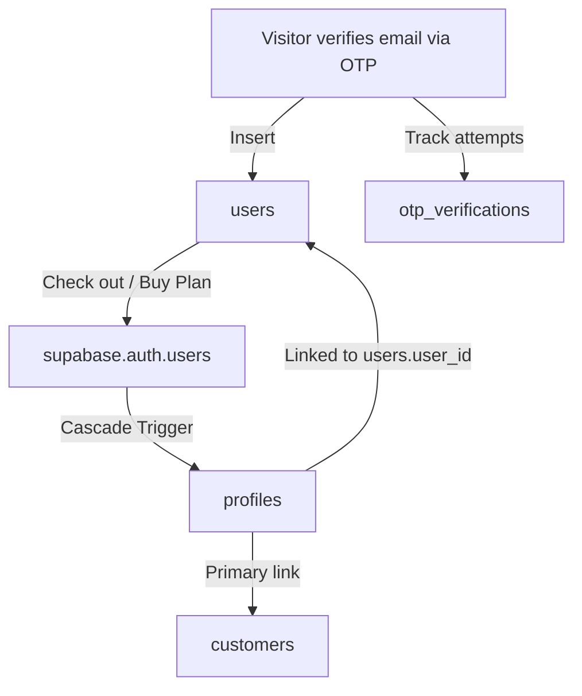

# HealthMitra Database Schema Reference

This document provides a comprehensive and detailed mapping of all database tables, columns, data types, constraints, and relationships in the **HealthMitra** Supabase database.

---

## 🏛️ Database Architecture & Core Flows

The database is built on top of Supabase and uses a Postgres database schema. RLS (Row Level Security) is enabled on all tables to enforce strict data isolation between customers, partners, and administrators.

### 1. User Authentication & Profile Flow


* **Step 1 (OTP Verification)**: When a visitor verifies their email via OTP, a record is added to `users` and tracked in `otp_verifications`.
* **Step 2 (Plan Purchase)**: Once they pay, a Supabase auth account is created. This automatically cascades to insert a profile in `profiles` with the role `'customer'`.
* **Step 3 (Activation)**: The customer's profile UUID is linked to `users.user_id`, a row is inserted into `customers` to track the plan purchase, and membership slots are created in `ecard_members`.

---

## 📂 Table Schema Directory

### 🔑 1. Auth, Profiles & Leads

#### `profiles`
Tracks credentials, contact info, and profile metadata for all system users (admins, employees, partners, and customers). Inherits from `auth.users` via a foreign key on the `id` column.

| Column | Type | Constraints / Default | Description |
| :--- | :--- | :--- | :--- |
| `id` | `UUID` | `PRIMARY KEY REFERENCES auth.users(id) ON DELETE CASCADE` | Unique user auth ID |
| `email` | `TEXT` | | Email address |
| `full_name` | `TEXT` | | User's full name |
| `phone` | `TEXT` | | Phone number |
| `role` | `TEXT` | `DEFAULT 'user'` | System role (`'admin'`, `'employee'`, `'customer'`, `'referral_partner'`, etc.) |
| `status` | `TEXT` | `DEFAULT 'active'` | Status (`'active'`, `'inactive'`) |
| `avatar_url` | `TEXT` | | Public URL for profile picture |
| `department_id` | `UUID` | | Linked to departments table |
| `designation` | `TEXT` | | Employment title |
| `city` | `TEXT` | | User city |
| `state` | `TEXT` | | User state |
| `address` | `TEXT` | | Street address |
| `pincode` | `TEXT` | | Zip/pincode |
| `dob` | `DATE` | | Date of Birth |
| `gender` | `TEXT` | | Gender |
| `blood_group` | `TEXT` | | Blood group |
| `aadhaar_number` | `TEXT` | | Personal Aadhaar card number |
| `pan_number` | `TEXT` | | Personal PAN card number |
| `bank_holder_name` | `TEXT` | | Bank account holder name |
| `bank_account_number` | `TEXT` | | Bank account number |
| `bank_ifsc` | `TEXT` | | Bank IFSC code |
| `bank_name` | `TEXT` | | Bank name |
| `bank_branch` | `TEXT` | | Bank branch name |
| `account_type` | `TEXT` | | Savings, Checking, etc. |
| `created_at` | `TIMESTAMPTZ` | `DEFAULT NOW()` | Date created |
| `updated_at` | `TIMESTAMPTZ` | `DEFAULT NOW()` | Date updated |

#### `users`
Superset table tracking everyone who has verified their email via OTP (including those who didn't complete a purchase).

| Column | Type | Constraints / Default | Description |
| :--- | :--- | :--- | :--- |
| `id` | `UUID` | `PRIMARY KEY DEFAULT uuid_generate_v4()` | Unique record ID |
| `email` | `TEXT` | `UNIQUE NOT NULL` | Verified email address |
| `name` | `TEXT` | | User name |
| `phone` | `TEXT` | | Phone number |
| `interested_plan_id` | `UUID` | `REFERENCES plans(id) ON DELETE SET NULL` | Plan selected during OTP flow |
| `user_id` | `UUID` | `REFERENCES profiles(id) ON DELETE SET NULL` | Linked to profiles UUID (populated after purchase) |
| `source` | `TEXT` | `DEFAULT 'otp_verify'` | Marketing source (`'otp_verify'`, `'admin_created'`, `'checkout'`) |
| `status` | `TEXT` | `DEFAULT 'active'` | Status (`'active'`, `'inactive'`) |
| `verified_at` | `TIMESTAMPTZ` | `DEFAULT NOW()` | Date of first email verification |
| `created_at` | `TIMESTAMPTZ` | `DEFAULT NOW()` | Date created |
| `updated_at` | `TIMESTAMPTZ` | `DEFAULT NOW()` | Date updated |

#### `otp_verifications`
Tracks detailed OTP verification history. Used by the admin panel to analyze unconverted potential customer leads.

| Column | Type | Constraints / Default | Description |
| :--- | :--- | :--- | :--- |
| `id` | `UUID` | `PRIMARY KEY DEFAULT uuid_generate_v4()` | Unique record ID |
| `email` | `TEXT` | `NOT NULL` | Checked email address |
| `name` | `TEXT` | | User name |
| `phone` | `TEXT` | | Phone number |
| `plan_id` | `UUID` | `REFERENCES plans(id) ON DELETE SET NULL` | Linked plan |
| `plan_name` | `TEXT` | | Denormalized plan name |
| `verify_count` | `INTEGER` | `DEFAULT 1` | Verification attempts count |
| `first_seen_at` | `TIMESTAMPTZ` | `DEFAULT NOW()` | First OTP verify date |
| `last_seen_at` | `TIMESTAMPTZ` | `DEFAULT NOW()` | Most recent OTP verify date |
| `verify_log` | `JSONB` | `DEFAULT '[]'::jsonb` | Array of `{ verified_at, plan_id, plan_name }` logs |
| `converted` | `BOOLEAN` | `DEFAULT false` | `true` if they purchased a plan (filters them from leads) |
| `created_at` | `TIMESTAMPTZ` | `DEFAULT NOW()` | Date created |
| `updated_at` | `TIMESTAMPTZ` | `DEFAULT NOW()` | Date updated |

---

### 💳 2. Memberships, E-Cards & KYC

#### `customers`
Tracks paying plan buyers. Always a subset of the `users` table.

| Column | Type | Constraints / Default | Description |
| :--- | :--- | :--- | :--- |
| `id` | `UUID` | `PRIMARY KEY DEFAULT uuid_generate_v4()` | Unique customer ID |
| `user_id` | `UUID` | `NOT NULL REFERENCES profiles(id) ON DELETE CASCADE` | Linked auth profile |
| `users_entry_id` | `UUID` | `REFERENCES users(id) ON DELETE SET NULL` | Reference to parent `users` record |
| `email` | `TEXT` | `NOT NULL` | Purchase email address |
| `full_name` | `TEXT` | `NOT NULL` | Purchaser's name |
| `phone` | `TEXT` | | Purchaser's phone |
| `plan_id` | `UUID` | `REFERENCES plans(id) ON DELETE SET NULL` | Purchased plan |
| `plan_name` | `TEXT` | | Denormalized plan name |
| `card_unique_id` | `TEXT` | | Unique card identifier |
| `member_id_code` | `TEXT` | | Member code string |
| `valid_from` | `DATE` | | Plan start date |
| `valid_till` | `DATE` | | Plan expiration date |
| `amount_paid` | `NUMERIC(12,2)` | `DEFAULT 0` | Net amount paid |
| `currency` | `TEXT` | `DEFAULT 'USD'` | Payment currency |
| `payment_method` | `TEXT` | | Gateway used (`'stripe'`, `'paypal'`, `'razorpay'`) |
| `transaction_id` | `TEXT` | | Gateway transaction ID |
| `status` | `TEXT` | `DEFAULT 'active'` | Status (`'active'`, `'expired'`, `'cancelled'`, `'suspended'`) |
| `created_at` | `TIMESTAMPTZ` | `DEFAULT NOW()` | Date created |
| `updated_at` | `TIMESTAMPTZ` | `DEFAULT NOW()` | Date updated |

#### `ecard_members`
Holds individual e-card slots allocated by the plan. For instance, a 4-member plan creates 1 primary (`'Self'`) slot and 3 dependents (`'Family Member'`) slots.

| Column | Type | Constraints / Default | Description |
| :--- | :--- | :--- | :--- |
| `id` | `UUID` | `PRIMARY KEY DEFAULT uuid_generate_v4()` | Unique card slot ID |
| `user_id` | `UUID` | `REFERENCES profiles(id) ON DELETE CASCADE` | Owner profile ID |
| `plan_id` | `UUID` | `REFERENCES plans(id) ON DELETE SET NULL` | Associated plan |
| `member_id_code` | `TEXT` | `UNIQUE` | Unique membership code |
| `card_unique_id` | `TEXT` | `UNIQUE` | Unique card number |
| `full_name` | `TEXT` | `NOT NULL` | Member's full name (blank until card is generated) |
| `relation` | `TEXT` | `DEFAULT 'Self'` | Relationship (`'Self'`, `'Spouse'`, `'Father'`, `'Mother'`, `'Son'`, `'Daughter'`, etc.) |
| `dob` | `DATE` | | Member DOB |
| `gender` | `TEXT` | | Member gender |
| `blood_group` | `TEXT` | | Member blood group |
| `contact_number` | `TEXT` | | Emergency contact number |
| `email` | `TEXT` | | Member email address |
| `aadhaar_last4` | `TEXT` | | Last 4 digits of Aadhaar (for quick display) |
| `status` | `TEXT` | `DEFAULT 'active'` | Slot status (`'pending'`, `'active'`, `'expired'`) |
| `valid_from` | `DATE` | | Validity start date |
| `valid_till` | `DATE` | | Validity end date |
| `coverage_amount` | `NUMERIC(12,2)` | `DEFAULT 0` | Coverage limit amount |
| `created_at` | `TIMESTAMPTZ` | `DEFAULT NOW()` | Date created |
| `updated_at` | `TIMESTAMPTZ` | `DEFAULT NOW()` | Date updated |

#### `policy_holder_kyc`
Stores secure KYC details and document links for each generated E-Card member slot.

| Column | Type | Constraints / Default | Description |
| :--- | :--- | :--- | :--- |
| `id` | `UUID` | `PRIMARY KEY DEFAULT uuid_generate_v4()` | Unique record ID |
| `member_id` | `UUID` | `UNIQUE NOT NULL REFERENCES ecard_members(id) ON DELETE CASCADE` | Linked ecard slot ID |
| `user_id` | `UUID` | `NOT NULL REFERENCES profiles(id) ON DELETE CASCADE` | Owner profile ID |
| `holder_full_name` | `TEXT` | `NOT NULL` | Policy holder legal name |
| `relation` | `TEXT` | `NOT NULL` | Relationship |
| `aadhaar_number` | `TEXT` | | 12-digit Aadhaar (null if self-declared) |
| `aadhaar_declaration` | `BOOLEAN` | `NOT NULL DEFAULT false` | `true` if user checked self-declaration |
| `aadhaar_file_url` | `TEXT` | | Public URL to Aadhaar scan |
| `aadhaar_file_path` | `TEXT` | | Storage file path |
| `pan_number` | `TEXT` | | 10-character PAN (null if self-declared) |
| `pan_declaration` | `BOOLEAN` | `NOT NULL DEFAULT false` | `true` if user checked self-declaration |
| `pan_file_url` | `TEXT` | | Public URL to PAN scan |
| `pan_file_path` | `TEXT` | | Storage file path |
| `photo_url` | `TEXT` | `NOT NULL` | Public URL to passport photo |
| `photo_path` | `TEXT` | | Storage file path |
| `kyc_submitted` | `BOOLEAN` | `NOT NULL DEFAULT false` | `true` if details are submitted |
| `kyc_submitted_at` | `TIMESTAMPTZ` | | Date of submission |
| `admin_verified` | `BOOLEAN` | `DEFAULT false` | `true` once marked verified by admin |
| `admin_verified_at` | `TIMESTAMPTZ` | | Date of admin verification |
| `admin_reset` | `BOOLEAN` | `DEFAULT false` | `true` if admin reset it for re-submission |
| `admin_reset_by` | `UUID` | `REFERENCES profiles(id) ON DELETE SET NULL` | Admin who reset it |
| `admin_reset_at` | `TIMESTAMPTZ` | | Date of admin reset |
| `admin_notes` | `TEXT` | | Admin review notes |
| `created_at` | `TIMESTAMPTZ` | `DEFAULT NOW()` | Date created |
| `updated_at` | `TIMESTAMPTZ` | `DEFAULT NOW()` | Date updated |

---

### 🏥 3. Health Claims & Service Management

#### `reimbursement_claims`
Stores reimbursement claims submitted by clients. Verified cards are required to file claims.

| Column | Type | Constraints / Default | Description |
| :--- | :--- | :--- | :--- |
| `id` | `UUID` | `PRIMARY KEY DEFAULT uuid_generate_v4()` | Unique claim ID |
| `claim_id_display` | `TEXT` | `UNIQUE` | Clean ID (`CLM-XXXXXX`) |
| `user_id` | `UUID` | `REFERENCES profiles(id) ON DELETE CASCADE` | Submitting customer ID |
| `plan_id` | `UUID` | `REFERENCES plans(id) ON DELETE SET NULL` | Selected plan |
| `plan_name` | `TEXT` | | Denormalized plan name |
| `title` | `TEXT` | | Claim summary title |
| `provider_name` | `TEXT` | | Hospital/Doctor name |
| `bill_date` | `DATE` | | Bill receipt date |
| `amount` | `NUMERIC(12,2)` | `DEFAULT 0` | Net amount |
| `amount_requested` | `NUMERIC(12,2)` | | Requested amount |
| `amount_approved` | `NUMERIC(12,2)` | | Approved refund amount |
| `status` | `TEXT` | `DEFAULT 'pending'` | Status (`'pending'`, `'approved'`, `'rejected'`) |
| `documents` | `JSONB` | `DEFAULT '[]'::jsonb` | Array of uploaded receipt files |
| `admin_notes` | `TEXT` | | Admin review remarks |
| `customer_comments` | `TEXT` | | Diagnosis / reason |
| `rejection_reason` | `TEXT` | | Rejection remarks |
| `created_at` | `TIMESTAMPTZ` | `DEFAULT NOW()` | Date submitted |
| `updated_at` | `TIMESTAMPTZ` | `DEFAULT NOW()` | Date updated |

#### `service_requests`
Tracks service bookings (Ambulance, Consultation, Diagnostics) submitted by customers.

| Column | Type | Constraints / Default | Description |
| :--- | :--- | :--- | :--- |
| `id` | `UUID` | `PRIMARY KEY DEFAULT uuid_generate_v4()` | Unique request ID |
| `request_id_display` | `TEXT` | `UNIQUE` | Clean ID (`SR-XXXXXX`) |
| `user_id` | `UUID` | `REFERENCES profiles(id) ON DELETE CASCADE` | Booking customer ID |
| `assigned_to` | `UUID` | `REFERENCES profiles(id) ON DELETE SET NULL` | Assigned support employee ID |
| `type` | `TEXT` | `NOT NULL` | Request type (`'ambulance'`, `'medical_consultation'`, `'diagnostic'`) |
| `status` | `TEXT` | `DEFAULT 'pending'` | Status (`'pending'`, `'in_progress'`, `'completed'`, `'cancelled'`) |
| `priority` | `TEXT` | `DEFAULT 'medium'` | Priority (`'low'`, `'medium'`, `'high'`, `'urgent'`) |
| `details` | `JSONB` | `DEFAULT '{}'::jsonb` | Dynamic options (booking time, symptoms, address) |
| `admin_notes` | `TEXT` | | Support notes |
| `created_at` | `TIMESTAMPTZ` | `DEFAULT NOW()` | Date created |
| `updated_at` | `TIMESTAMPTZ` | `DEFAULT NOW()` | Date updated |

#### `phr_documents`
Stores medical history, prescriptions, and lab reports in the Personal Health Record (PHR).

| Column | Type | Constraints / Default | Description |
| :--- | :--- | :--- | :--- |
| `id` | `UUID` | `PRIMARY KEY DEFAULT uuid_generate_v4()` | Unique document ID |
| `user_id` | `UUID` | `REFERENCES profiles(id) ON DELETE CASCADE` | Customer profile ID |
| `member_id` | `UUID` | `REFERENCES ecard_members(id) ON DELETE SET NULL` | Associated ecard member |
| `name` | `TEXT` | `NOT NULL` | Document name |
| `category` | `TEXT` | | Category (`'Prescriptions'`, `'Test Reports'`, `'Bills'`) |
| `file_url` | `TEXT` | | Public URL to storage file |
| `doctor_name` | `TEXT` | | Prescribing doctor name |
| `tags` | `JSONB` | `DEFAULT '[]'::jsonb` | Search filter tags |
| `created_at` | `TIMESTAMPTZ` | `DEFAULT NOW()` | Date created |
| `updated_at` | `TIMESTAMPTZ` | `DEFAULT NOW()` | Date updated |

---

### 🤝 4. Franchise & Partner Referral Network

#### `franchises`
Details active Referral Partners / Franchise offices inside the network.

| Column | Type | Constraints / Default | Description |
| :--- | :--- | :--- | :--- |
| `id` | `UUID` | `PRIMARY KEY DEFAULT uuid_generate_v4()` | Unique franchise ID |
| `franchise_name` | `TEXT` | `NOT NULL` | Name of the office/owner |
| `code` | `TEXT` | `UNIQUE` | Assigned partner code |
| `contact_email` | `TEXT` | | Corporate email |
| `contact_phone` | `TEXT` | | Phone |
| `alt_phone` | `TEXT` | | Backup phone |
| `website` | `TEXT` | | Website link |
| `gst_number` | `TEXT` | | Tax ID |
| `commission_percentage` | `NUMERIC(5,2)` | `DEFAULT 10` | Referral commission rate |
| `address` | `TEXT` | | Physical address |
| `city` | `TEXT` | | City |
| `state` | `TEXT` | | State |
| `pincode` | `TEXT` | | Zip |
| `bank_details` | `JSONB` | `DEFAULT '{}'::jsonb` | Bank routing data |
| `status` | `TEXT` | `DEFAULT 'active'` | Status (`'active'`, `'inactive'`) |
| `verification_status` | `TEXT` | `DEFAULT 'pending'` | KYC audit status (`'pending'`, `'approved'`, `'rejected'`) |
| `verified_at` | `TIMESTAMPTZ` | | Verification date |
| `verified_by` | `UUID` | `REFERENCES profiles(id) ON DELETE SET NULL` | Auditing admin ID |
| `rejection_reason` | `TEXT` | | Auditing feedback notes |
| `aadhaar_number` | `TEXT` | | Aadhaar ID |
| `aadhaar_front` | `TEXT` | | Image link |
| `aadhaar_back` | `TEXT` | | Image link |
| `pan_number` | `TEXT` | | PAN ID |
| `pan_card` | `TEXT` | | Image link |
| `photo` | `TEXT` | | Image link |
| `mou_signed` | `BOOLEAN` | `DEFAULT false` | `true` if agreement signed |
| `mou_date` | `DATE` | | Signing date |
| `total_members` | `INTEGER` | `DEFAULT 0` | Aggregated signups |
| `total_sales` | `NUMERIC(12,2)` | `DEFAULT 0` | Aggregated sales revenue |
| `total_commission` | `NUMERIC(12,2)` | `DEFAULT 0` | Aggregated earnings |
| `created_at` | `TIMESTAMPTZ` | `DEFAULT NOW()` | Date created |
| `updated_at` | `TIMESTAMPTZ` | `DEFAULT NOW()` | Date updated |

---

### ⚙️ 5. Core Lookup Tables & Settings

* **`plans`**: Contains the specifications, prices, and allowed services (OPD list, etc.) of available plans.
* **`plan_categories`**: Dynamic categories (`Consultation`, `Diagnostics`, etc.) for organizing health plans.
* **`departments`**: Service departments (`Customer Support`, `Sales`, `Claims`). Used for routing support tickets.
* **`phr_categories`**: Medical record grouping types (`Prescriptions`, `Test Reports`, `Bills`).
* **`homepage_sections`**: Homepage CMS configuration components (`hero`, `features`, `plans`, etc.).
* **`system_settings`**: Global site settings (API keys, currency parameters, email settings).
* **`faqs`**: Frequently Asked Questions.
* **`testimonials`**: Customer reviews.
* **`pages`**: Custom HTML/Markdown CMS pages.
* **`cities`**: Dynamic Tier 1 / Tier 2 serviceable locations and pin codes.

---

## ⚡ Core Database Indexes

Indexes are built on top of reference keys to guarantee fast search queries in dashboard tables:

```sql
-- Profiles & Users Lookup
CREATE INDEX IF NOT EXISTS idx_profiles_email ON profiles(email);
CREATE INDEX IF NOT EXISTS idx_profiles_role ON profiles(role);
CREATE INDEX IF NOT EXISTS idx_profiles_status ON profiles(status);
CREATE INDEX IF NOT EXISTS idx_users_email ON users(email);
CREATE INDEX IF NOT EXISTS idx_users_user_id ON users(user_id);

-- Memberships & E-Cards
CREATE INDEX IF NOT EXISTS idx_ecard_members_user_id ON ecard_members(user_id);
CREATE INDEX IF NOT EXISTS idx_ecard_members_plan_id ON ecard_members(plan_id);
CREATE INDEX IF NOT EXISTS idx_customers_user_id ON customers(user_id);
CREATE INDEX IF NOT EXISTS idx_customers_email ON customers(email);

-- Claims & Financials
CREATE INDEX IF NOT EXISTS idx_reimbursement_claims_user_id ON reimbursement_claims(user_id);
CREATE INDEX IF NOT EXISTS idx_reimbursement_claims_status ON reimbursement_claims(status);
CREATE INDEX IF NOT EXISTS idx_payments_user_id ON payments(user_id);
CREATE INDEX IF NOT EXISTS idx_payments_status ON payments(status);
CREATE INDEX IF NOT EXISTS idx_invoices_user_id ON invoices(user_id);
CREATE INDEX IF NOT EXISTS idx_coupons_code ON coupons(code);

-- Services & Requests
CREATE INDEX IF NOT EXISTS idx_service_requests_user_id ON service_requests(user_id);
CREATE INDEX IF NOT EXISTS idx_service_requests_assigned_to ON service_requests(assigned_to);
CREATE INDEX IF NOT EXISTS idx_service_requests_status ON service_requests(status);
CREATE INDEX IF NOT EXISTS idx_phr_documents_user_id ON phr_documents(user_id);
```
